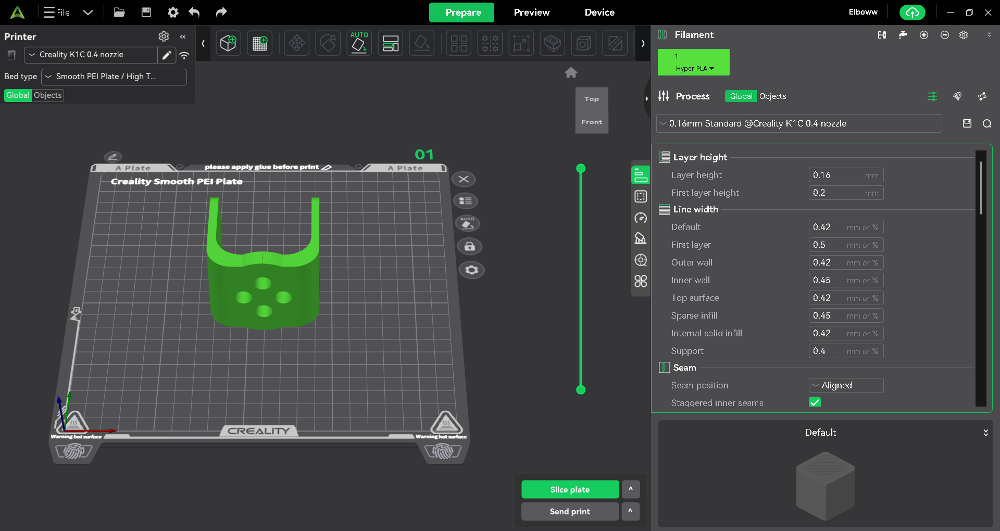
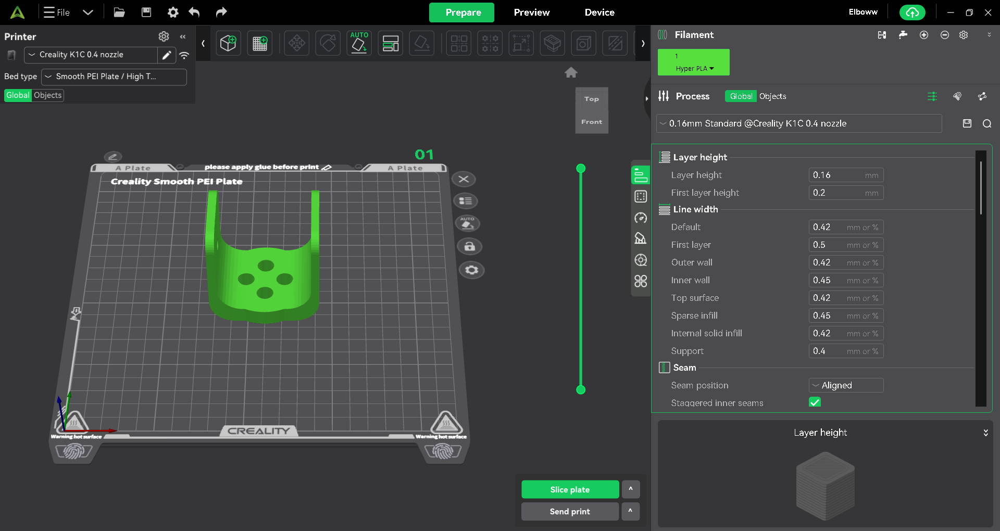
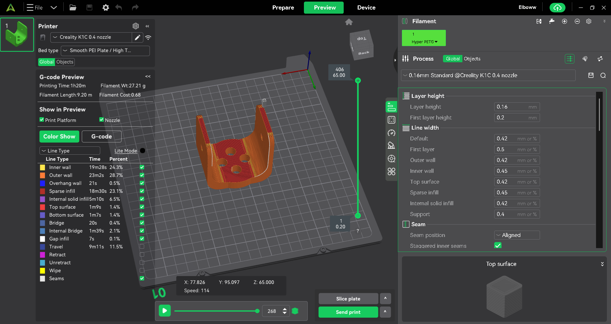
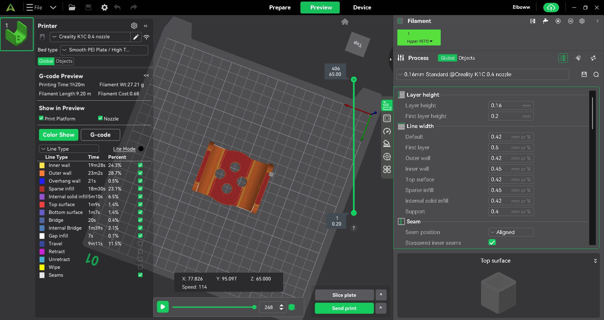

# Robotic-Arm-Joint-3D-Print

## Overview

This repository contains the files and details related to the 3D printing of a robotic arm joint. It includes the STL file, suggested printing settings, material recommendations with justifications, and the expected features of the printed part.

---

## Methods

The robotic arm joint model is provided in STL format. This file is then imported into a 3D printer slicing software to prepare it for printing.

### Slicer Software

For this project, **Creality Print** (as shown in the provided screenshots) was used to prepare the model for 3D printing. Slicing software like Creality Print allows users to:

- Import 3D models (e.g., STL, 3MF).
- Position and orient the part on the build plate.
- Adjust various printing parameters such as layer height, infill density, print speed, and support structures.
- Generate G-code, which is the set of instructions for the 3D printer.

### Printing Settings

The following screenshots illustrate the printing settings used for the robotic arm joint in Creality Print. These settings are a good starting point and can be adjusted based on your specific 3D printer and desired print quality.

  

<b>Figure 1: Initial Settings in Creality Print</b>

Figure 1 shows the initial view of the model loaded into Creality Print, displaying the default settings for layer height and line width.

  

<b>Figure 2: After clicking the "Auto" button</b>

Figure 2 shows the settings after clicking the "Auto" button in Creality Print, which automatically adjusts the part's orientation, layer height (0.16 mm), and infill settings. This automated adjustment aims to optimize the print for support and overall quality. A layer height of 0.16 mm was chosen for a balance between detail and print time. The infill density is typically set around 20% for functional parts to provide sufficient strength without excessive material usage.

  

<b>Figure 3: Sliced Model Preview</b>

Figure 3 presents a preview of the sliced model, showing the internal infill structure and estimated print time and material consumption. This view helps visualize how the part will be constructed layer by layer.

  

<b>Figure 4: Top View of Sliced Model</b>

Figure 4 provides a top-down view of the sliced model, allowing for a detailed inspection of the layer paths and infill patterns.

---

## Material

The recommended material for 3D printing the robotic arm joint is **PETG (Polyethylene Terephthalate Glycol)**. This choice is based on the following properties:

-   **Strength and Durability:** PETG is stronger and more durable than PLA, offering good impact resistance, which is crucial for functional parts subjected to mechanical stress. It is also less prone to breaking than PLA.

-   **Heat Resistance:** PETG has better heat resistance compared to PLA, reducing the likelihood of part deformation when exposed to slightly higher temperatures, which is important in applications where movement might generate friction and heat.

-   **Ease of Printing:** While not as easy to print as PLA, PETG is significantly easier to print than ABS, as it is less prone to warping and shrinking during printing. This reduces printing challenges and ensures more reliable results.

-   **Moisture and Chemical Resistance:** PETG exhibits good resistance to moisture and chemicals, making it suitable for use in various environments without its performance being affected over time.

-   **Layer Adhesion:** PETG provides excellent layer adhesion, resulting in strong, cohesive parts that are less likely to delaminate under load.

### Comparison with Other Materials:

*   **PLA:** Despite its ease of printing and availability, PLA lacks the durability and heat resistance required for a functional robot joint under stress. It can be brittle and easily deform under heat.

*   **ABS:** ABS offers good strength, durability, and heat resistance, but it is more challenging to print due to its high tendency to shrink and warp, typically requiring an enclosed build chamber. It also produces strong fumes during printing.

*   **Nylon:** Nylon is an excellent material for strength, durability, and wear resistance, but it is more difficult to print and requires specific conditions (such as proper material drying before printing). It could be a good option if maximum durability is the top priority and suitable printing conditions are available.

## Features

When printed with PETG, the robotic arm joint is expected to exhibit the following characteristics:

-   **Lightweight:** Contributes to the overall efficiency and responsiveness of the robotic arm.
-   **Durability:** Enhances the part's resilience to absorb shocks and withstand repeated movements.
-   **Good Surface Finish:** Minimizes surface imperfections and reduces the likelihood of cracks.
-   **Stable Dimensions:** Ensures precise fitting for holes and pins, leading to better assembly and reduced tolerances.
